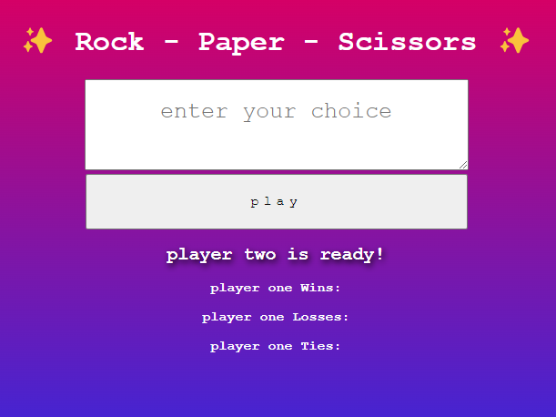

# rock-paper-scissor

## Description
The active application is a program that will allow you to play rock paper scissors against a computerized opponent. Your wins and losses will be logged beneath the form.

## Usage
The following is a picture of what the website should look like when opened in a browser.

The following is a link to [the deployed code]([deployed link](https://jessalane.github.io/rock-paper-scissor/)).
